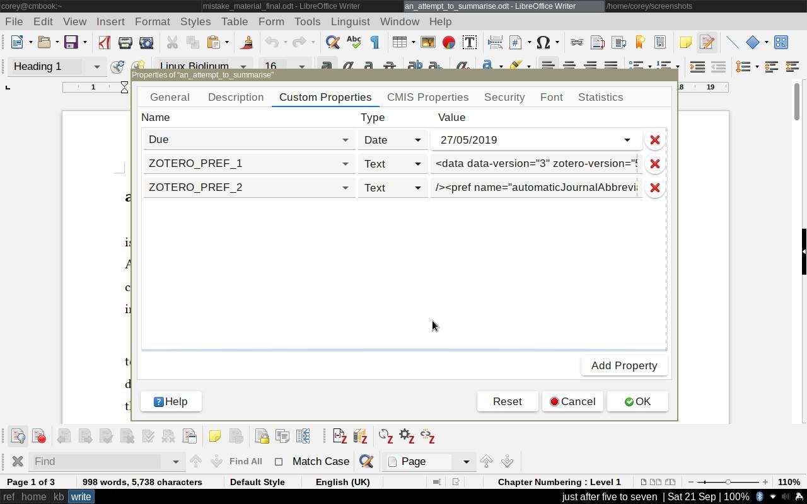

# PhD tools

This repo holds a number of scripts and methods that I have made over the course of my PhD to help me organise myself. Obviously they could be used for any writing project; but since the project I was working on was a doctorate, the name of the repo reflects this.

## scope

The tools are for **Linux systems**, as Linux is the only operating system I use. I haven't tested it anywhere else, and am not able to do so. But some of this will still be useful.

The software I used:

+ [Conky][co]
+ [Libreoffice/Openoffice][lo]
+ [exiftool][ex]
+ A Git hosting service (like [Github](https://github.com/), [Gitlab](https://about.gitlab.com/), &c.)

## setup

The original way I did it was messy, and I found a way through trials and constant errors. This will be much more ordered.

### 1. Set up a private repository (or some form of version control store)

1. Make a folder on your computer where your chapters/sections/media are going to be stored.
2. Sign up for an account on a Git hosting service
3. Make a private repo (these are free on both Github and Gitlab) -- here, I will call it "phd-git"
4. Follow instructions to link folder on computer to Git repo
5. Copy your documents into the folder and then upload them to the repo.
6. Optionally give access to supervisory team/critical friends. These people will also need accounts.
    On Github, you can have up to three "collaborators". Go to *Settings > Collaborators*
    On Gitlab, you can set *roles* for "members" of your project. Go to *Settings > Members*.
    
Alternatively, use webdav, Keybase, CVS, Onedrive... basically anything that will BACKUP YOUR WORK without you having to remember. Do this in at least two places and save yourself any potential heartache. I am saying this because there is seemingly **no** research handbook that will tell you to backup your work.

Backup your work.
   
### 2. Word counts

Some people rely on word counts to motivate them. The word count in Libreoffice is useful, but sometimes you just need to know how many words there are without opening up the document. The two scripts do this, and a bit more.

If you have everything in a single document, then **phd-final-count** will be useful. If you have chapters or sections in separate documents (maybe [using a master document][lmd]), then use **phd-word-count**. It also uses *exiftool* to extract some custom properties from each document ([you can set these in Libreoffice][lcp]). For example, I set up a "Due" property for each section, to tell me when I needed to send something to my supervisors.



**phd-word-count** also generates a file that you can use in Conky.

### 3. Tasks/to-do lists

I have also included a simple `nanorc` style file for todo lists; and a script that generates a text file for Conky. There is quite a bit of advice of writing to-do lists, and I won't replicate it here. Personally, I found the Urgent-Important Matrix useful, so I added a simple way being able to add that into a `TODO` or `tasks` text file.

+ Urgent = to be done right way
+ Important = to be done by you because you care

The text file is edited in `nano`. Somewhere in the task line, type one of the following marks:

+ [ui] - neither urgent nor important. Do other things instead
+ [uI] - not urgent, but important. Use this for things you want to plan for the future
+ [Ui] - Urgent, but not important. Use this for things you could ask other to help with or do.
+ [UI] - Urgent and important. Do this now.


Here's a short example:

```
Chapter five! #ontology #narrativeturn due:2019-05-15 [UI]
Write up CV [uI]
Shopping for dinner [Ui]
Tidy papers [ui]
```

You can then use the `ui-matrix` script to display them or , if you wish

```
[~]$ ui-matrix 
*Urgent and Important*
Chapter five! #ontology #narrativeturn due:2019-05-15 

*Urgent, but not important*
Shopping for dinner 

*Not urgent, but Important*
Write up CV 

*Neither urgent nor important*
Tidy papers 

[~]$ ui-matrix UI
*Urgent and Important*
Chapter five! #ontology #narrativeturn due:2019-05-15 
```

[co]: https://github.com/brndnmtthws/conky
[lo]: https://libreoffice.org
[ex]: https://sno.phy.queensu.ca/~phil/exiftool/
[lmd]: https://help.libreoffice.org/6.3/en-GB/text/swriter/guide/globaldoc.html?DbPAR=WRITER#bm_id3145246
[lcp]: https://help.libreoffice.org/6.3/en-GB/text/shared/guide/viewing_file_properties.html?DbPAR=SHARED#bm_id3152594
